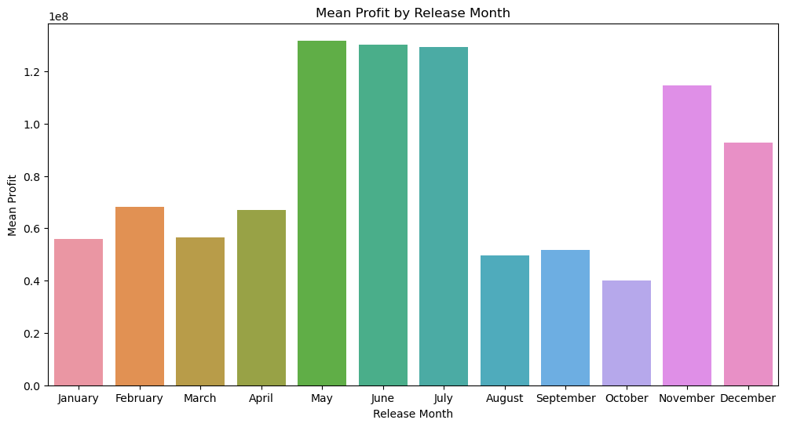

# Blockbuster Blueprint for Microsoft's Movie Mastery

## Introduction
Microsoft, the tech giant that has mastered software and gaming, now aims to venture into the movie industry by creating a movie studio. This project leverages data analysis to decode the box office formula, providing crucial insights to guide strategic decisions for producing profitable films.

## Project Goals
- To provide data-driven insights for Microsoft's new movie studio.
- To optimize financial investments and maximize box office success.
- To influence production choices, marketing strategies, and overall studio direction.

## Data Sources
The data used in this project was collected from multiple reputable sources:
1. **IMDB Local Database**: Detailed information on movies and TV shows.
2. **Rotten Tomatoes Reviews**: Aggregated critical reception data.
3. **Rotten Tomatoes Movie Info**: Comprehensive movie details.
4. **The Numbers Movie Budgets**: Financial details on movie budgets and performance.
5. **TMDb Movies**: Additional movie-related information.

## Data Preparation
1. **Data Collection**: Gathered data from the aforementioned sources.
2. **Data Cleaning**: Handled missing values, standardized formats.
3. **Data Integration**: Merged datasets using common keys and removed duplicates.
4. **Feature Engineering**: Created new features like profit.
5. **Exploratory Data Analysis (EDA)**: Calculated descriptive statistics and generated visualizations.
6. **Bivariate and Correlation Analysis**: Computed correlation coefficients and visualized relationships.

## Analysis and Visualizations
### Key Metrics
#### **Runtime**:


Mean: 104.8 minutes, Range: 41 to 180 minutes

#### **Production Budget**: 


Mean: $39 million, Range: $9,000 to $410.6 million

#### **Domestic Gross**: 


Mean: $48.3 million, Range: $0 to $700 million

#### **Worldwide Gross**: 


Mean: $119 million, Range: $0 to $2.048 billion

#### **Profit**: 


Mean: $80 million, Range: -$110.5 million to $1.748 billion

#### **Average Rating**: 


Mean: 6.19, Range: 2 to 8.9

### Key Findings

#### **Runtime vs. Profit**: 


Slightly longer movies tend to be more profitable.

#### **Genres vs. Profit**:


Animation, Adventure, and Sci-Fi genres are financially rewarding.

#### **Release Month vs. Profit**: 


Highest profits in May, June, July, November, and December.

#### **Production Budgets vs. Profit**: 


Higher production budgets tend to relate to more profits.

#### **Optimum Production Budget Range**: 


The optimal budget range to maximize profits appears to be $300M-$400M.

#### **Ratings vs. Profit**: 


Higher-rated movies tend to be more profitable.

#### **Director Impact on Profits**: 


Top directors (e.g., Joss Whedon, Anthony Russo) show high mean profits.

---

## Recommendations
1. **Focus on High-Performing Genres**: Invest in Animation, Adventure, and Sci-Fi genres.
2. **Strategic Release Timing**: Release major films in peak months: May, June, July, November, and December.
3. **Optimal Production Budgets**: Allocate higher budgets ($100M-$400M) for potential blockbusters. Balance investments in mid-range budgets ($100M-$200M).
4. **Leverage High-Rating Factors**: Ensure high production quality, compelling storytelling, and strong performances.
5. **Director and Talent Strategy**: Collaborate with top directors and develop in-house talent.
6. **Monitor Market Trends and Audience Preferences**: Stay agile with market trends and audience feedback.

---

## Limitations of the Analysis
- **Data Variability**: High variability in key metrics such as budgets and gross earnings.
- **Correlation vs. Causation**: Correlations observed do not imply direct causation.
- **External Factors**: Unaccounted external factors like economic conditions and competition.

## Next Steps
1. **Implement Data-Driven Decision Making**: Establish a dedicated data analysis team to continuously monitor and analyze data.
2. **Optimize Resource Allocation**: Create a balanced budget allocation framework focusing on high-potential genres and strategic release periods.
3. **Enhance Marketing and Promotion**: Plan comprehensive marketing campaigns for major releases.
4. **Develop Talent**: Invest in scouting and developing new talent, both in front of and behind the camera.

## Conclusion
Data-driven insights are crucial for strategic decision-making. The recommendations based on this analysis can optimize investments and maximize box office success, ensuring competitive success in the dynamic film industry.

---

### How to Use This Repository

1. **Clone the repository**:
   ```bash
   git clone https://github.com/yourusername/blockbuster-blueprint.git

2. **Navigate to the project directory**:
    ```bash
    cd blockbuster-blueprint

3. **Open the jupyter Notebook**:
    ```bash
    jupyter notebook index.ipynb

4. **Run the cells to see the analysis and visualizations.**

---

## Licence
This project is licensed under the MIT License.